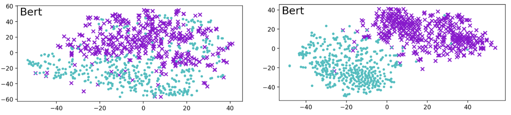
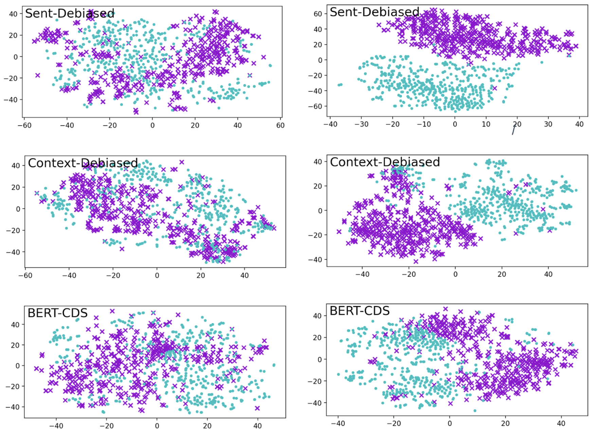
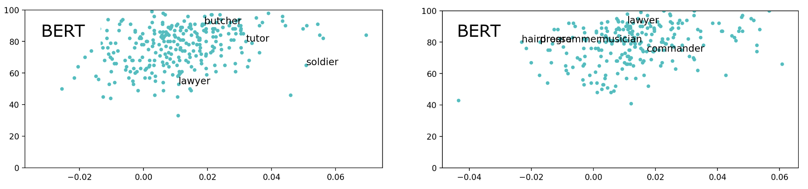

# Lipstick on a Pig “Again”: Analysis on Contextualised Embeddings

Revealing *systematic* gender biases in pre-trained BERT, and more importantly in **debiased BERT models**.
<!-- Proceeded in CS475, KAIST, 2022 Fall. -->

## Abstract

[Lipstick on a Pig: Debiasing Methods Cover up Systematic Gender Biases in Word Embeddings But do not Remove Them](https://arxiv.org/pdf/1903.03862.pdf) shows that existing gender bias removal methods in word embeddings are superficial, and should not be trusted. Meanwhile, recent advances in contextual models have been astonishing, and many researchers have proved the existence of the biases and proposed different mitigation methods for those models. For this reason, we extend [Gonen and Goldberg (2019)](https://arxiv.org/pdf/1903.03862.pdf) to discover gender biases in contextualised language models. As a result, we have identified the presence of *systematic* gender biases in pre-trained BERT and also in debiased BERT models. We hope that our work will inspire future research on analyzing gender biases of diverse debiasing methods.

For the entire piece, please refer to [Lipstick on a Pig “Again”: Analysis on Contextualised Embeddings]().

## About the Project

This project extends the original [paper](https://arxiv.org/pdf/1903.03862.pdf):

**"Lipstick on a Pig: Debiasing Methods Cover up Systematic Gender Biases in Word Embeddings But do not Remove Them"**, Hila Gonen and Yoav Goldberg, NAACL 2019

Please refer to [here](./docs/original.md) for a brief description of the original paper.

### Lipstick on a Pig "Again"

Our approach tackles next two research questions:

- **RQ1.** How much gender bias do the contextualised BERT embeddings contain?
- **RQ2.** Did the proposed debiased BERT models really resolve gender biases?

**RQ1** verifies the existence of gender bias in pre-trained BERT (bert-base-uncased), and with **RQ2**, we claim the state-of-the-art debiasing methods are not effective in mitigating gender biases.

### Data and Experiments

To argue successful replication in contextualised environment, word pools used in the original paper are retained. Then, templates from [May et al. (2019)](https://arxiv.org/pdf/1903.10561.pdf) were adopted to build the words into sentences. For a proper application, words other than nouns are filtered out, yielding 18,445 and 39,385 words respectively. 

> May et al., (2019). [On Measuring Social Biases in Sentence Encoders](https://arxiv.org/abs/1903.10561) (NACCL 2019)

Next, `first` + `last` technique (e.g. `babysitter => ‘baby’ + ‘##sit’ + ‘##ter’`) was used for pooling chosen from [Ács et al. (2021)](https://www.researchgate.net/publication/349520093_Subword_Pooling_Makes_a_Difference) and last four hidden layers of BERT were concated to best preserve contextual information ([Devlin et al., 2018](https://arxiv.org/pdf/1810.04805.pdf)). 

> Ács et al. (2021). [Subword Pooling Makes a Difference](https://www.researchgate.net/publication/349520093_Subword_Pooling_Makes_a_Difference) (EACL 2021)  
> Devlin et al. (2018). [BERT: Pre-training of Deep Bidirectional Transformers for Language Understanding](https://arxiv.org/abs/1810.04805) (NAACL 2019)

Experiment 1, 3, 5 from the original paper was used for our analysis.

### Debiased Models

The experiments were applied to three debiased models: [Sent-Debiased](https://aclanthology.org/2020.acl-main.488.pdf), [Context-Debiased](https://aclanthology.org/2021.eacl-main.107.pdf), [BERT-CDS](https://aclanthology.org/2020.gebnlp-1.1.pdf), from three papers below, respectively.

> Liang et al. (2020). [Towards Debiasing Sentence Representations](https://aclanthology.org/2020.acl-main.488), (ACL 2020)  
> Kaneko and Bollegala (2021). [Debiasing Pre-trained Contextualised Embeddings](https://aclanthology.org/2021.eacl-main.107) (EACL 2021)  
> Bartl et al. (2020). [Unmasking Contextual Stereotypes: Measuring and Mitigating BERT’s Gender Bias](https://aclanthology.org/2020.gebnlp-1.1) (GeBNLP 2020)

### Results

- **RQ1.** How much gender bias do the contextualised BERT embeddings contain?  
: Contextualised BERT embeddings also demonstrated clear gender biases.

- **RQ2.** Did the proposed debiased BERT models really resolve gender biases?  
: No, gender biases still remained after debiasing.

#### Experiment 1: Male- and female-biased words cluster together





#### Experiment 2: Professions




#### Experiment 3: Classifying previously female- and male-biased words

|                  | Word2Vec | GloVe        |
| ---------------- | -------- | ------------ |
| BERT             | 99.4%    | 99.9%        |
| Sent-Debiased    | 98.7%    | 100%         |
| Context-Debiased | 94.2%    | 98.5%        |
| BERT-CDS         | 96.8%    | 98.8%        |

### Paper and Presentation

- [Lipstick on a Pig “Again”: Analysis on Contextualised Embeddings]()
- [Presentation](https://www.youtube.com/watch?v=3-ZAgVxtclM&list=PL-nWDVwiX2BcCnME6oy0OLumYlkFFXr0-)
- [Slides](https://docs.google.com/presentation/d/19HI123JeJn0smyjredlQucBH6oGA-3mZXNgzlN6i1O0)

## Development

Please refer to [https://github.com/gonenhila/gender_bias_lipstick](https://github.com/gonenhila/gender_bias_lipstick) for the code and data of the original project.

### Folder Structure

```
lipstick-on-a-pig
├── README.md
├── LICENSE
├── .gitignore
├── archive
├── data - original, extracted embeddings
│   ├── embeddings
│   ├── lists
│   └── extracted
├── results - images
├── source
│   ├── remaining_bias_2016.ipynb
│   ├── remaining_bias_2018.ipynb
│   ├── compute_bert_sentence.ipynb
│   ├── compute_debiased_sentence.ipynb
│   └── experiments.ipynb
├── assets
└── docs
```

> Archive stores different experiments: retaining 2500 words from original paper (should only retain whole restricted vocabulary), sentence consisting of only one word (`compute_bert_word.ipynb`, `compute_debiased_word.ipynb`), extracting the average of entire sentence embedding without positional information, and more.

### About the Code

#### Execution Steps

1. Process restricted vocabulary from `remaining_bias_2016.ipynb`, `remaining_bias_2018.ipynb`
1. Compute BERT vocabulary and embeddings with `compute_bert_sentence.ipynb`
1. Compute debiased embeddings with `compute_debiased_sentence.ipynb`
1. Run `experiments.ipynb`

#### Debiased Models

Debiased models are acquired from github repositories:

- Sent-Debiased - https://github.com/pliang279/sent_debias
- Context-Debiased - https://github.com/kanekomasahiro/context-debias
- Bert-CDS - https://github.com/marionbartl/gender-bias-BERT

## Collaborators

> Sorted in Hangeul, Korean alphabetical order.

- [Hong Seok, Kang](https://github.com/ghdtjr)
- [Kyung Wook, Nam](https://github.com/nkwook)
- [Hyoung Jo, Bhang](https://github.com/colorsquare)

## License

This project is licensed under Apache License - see the [LICENSE](LICENSE) file for details.
